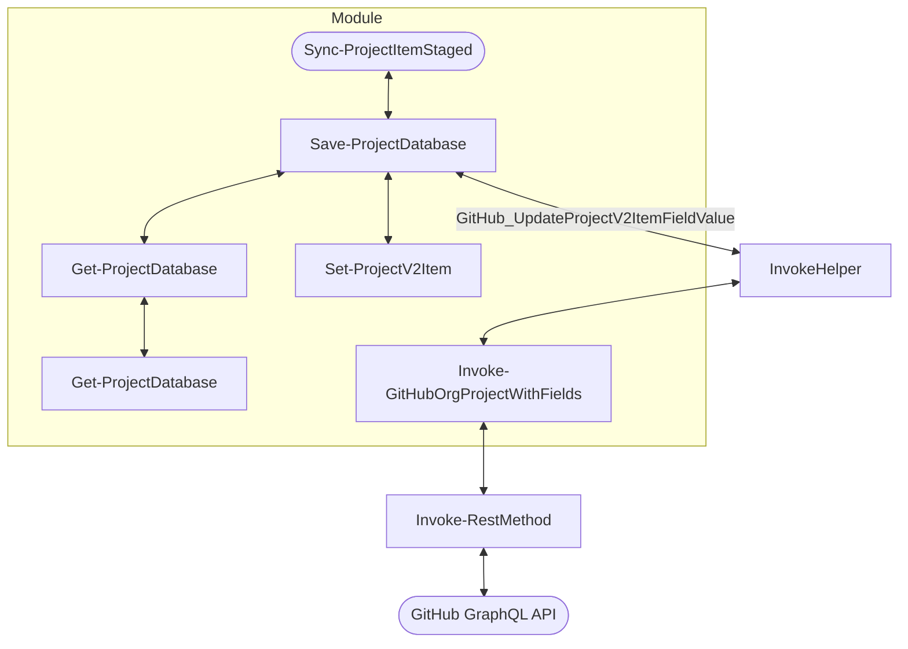
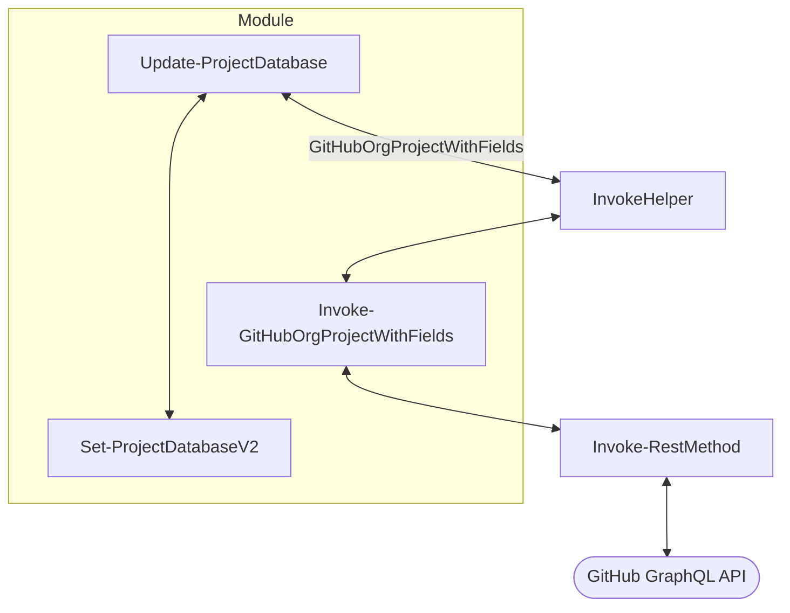

# Development notes

Notes used during the development of the module

## Save-ProjectDatabase

```mermaid
graph TD;

    

    subgraph Module
        0([Sync-ProjectItemStaged])
        1[Save-ProjectDatabase]
        2[Get-ProjectDatabase]
        3[Get-ProjectDatabase]
        4[Set-ProjectV2Item]
        0<-->1
        1<-->2
        2<-->3
        1<-->4


        G[Invoke-GitHubOrgProjectWithFields]
    end
    1 <-- GitHub_UpdateProjectV2ItemFieldValue --> E

    E[InvokeHelper]
    I([GitHub GraphQL API])
    H[Invoke-RestMethod]
    G <--> H
    E <--> G
    H <--> I


    
```

## Update-ProjectDatabase

```mermaid
graph TD;


    subgraph Module
    U[Update-ProjectDatabase]
    G[Invoke-GitHubOrgProjectWithFields]

    U<---->V2[Set-ProjectDatabaseV2]

    end
    I<-->G
    

    U<-- GitHubOrgProjectWithFields--> I[InvokeHelper]
    G <--> H[Invoke-RestMethod]
    H <--> Q([GitHub GraphQL API])
    
```